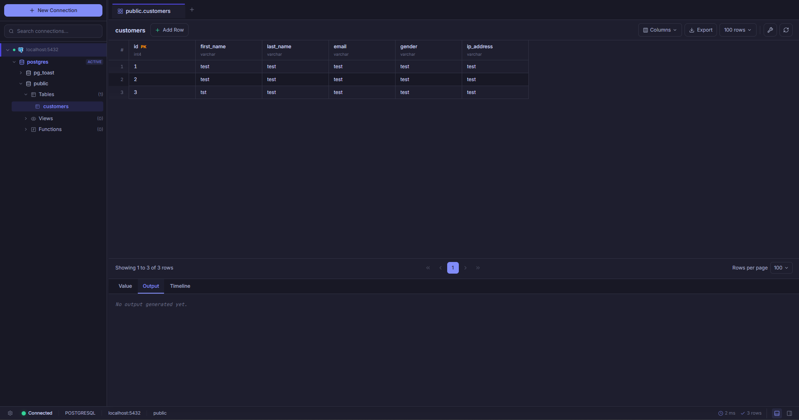

# Table View

[](https://github.com/vantoan1511/table-view/releases)
[](https://opensource.org/licenses/MIT)
[](https://neutralino.js.org/)
[](https://vuejs.org/)
[](https://www.rust-lang.org/)

**Table View** is a lightweight, high-performance desktop database management tool built for the modern developer. By combining the flexibility of **Vue 3** with the raw power of a **Rust-based backend extension**, it provides a lightning-fast experience for managing PostgreSQL, MySQL, SQLite, and Oracle databases.



## ✨ Features

- **Multi-Engine Support**: Native drivers for PostgreSQL, MySQL, SQLite, and Oracle (pure Rust thin-driver).
- **High-Precision Telemetry**: Backend-level query timing (ms) displayed in the Status Bar for accurate performance profiling.
- **Premium Data Grid**:
  - **Inline Editing**: Double-click any cell to edit data instantly with transactional save/discard.
  - **Enhanced Selection**: Premium ring highlights and background tints for clear cell focus.
  - **Bulk Operations**: Seamlessly select and delete multiple rows.
  - **Constraint Validation**: Early-stage attribute constraint validation to prevent invalid data entry.
- **Advanced Workspace**:
  - **Value Viewer**: A dedicated, monospaced viewer optimized for large cell content (JSON, long text, etc.).
  - **Inspector**: Real-time table properties, constraints, and index definitions.
  - **Timeline & Console**: Track your query history and system logs in one place.
- **SQL Editor**: Professional-grade editor powered by **CodeMirror 6** with syntax highlighting, autocompletion, and tab persistence.
- **Refined UX**:
  - **Dark Mode**: A sleek, high-contrast aesthetic designed for long coding sessions.
  - **Layout Persistence**: Automatically restores your workspace configuration (panel sizes, visibility) across sessions.
  - **Toast Notifications**: Beautiful, non-intrusive feedback via a centralized toast system.
  - **Unified Logging**: Consolidates frontend and backend diagnostics into a single root `.log` file.

## 🛠️ Tech Stack

- **Core Runtime**: [NeutralinoJS](https://neutralino.js.org/)
- **Frontend**: [Vue 3](https://vuejs.org/) with [Pinia](https://pinia.vuejs.org/)
- **Styling**: [Tailwind CSS 4](https://tailwindcss.com/)
- **Icons**: [Lucide Vue Next](https://lucide.dev/)
- **Editor**: [CodeMirror 6](https://codemirror.net/)
- **Backend Bridge**: High-performance **Rust** extension powered by `sqlx` and `deadpool-oracle`.

## 🚀 Getting Started

### Download & Installation (End Users)

For the easiest setup, you can install **Table View** directly using one of the methods below:

#### Method A: Via Windows Package Manager (WinGet)
You can install the official release directly from your command line:
```bash
winget install vantoan1511.TableView
```

#### Method B: Direct Installer
1. Download the latest `setup.exe` from the [GitHub Releases](https://github.com/vantoan1511/table-view/releases) page.
2. Run the installer and follow the prompt.

> [!NOTE]
> **Microsoft Defender SmartScreen Warning:** 
> Because this is an open-source application and is not signed with a paid developer certificate, Windows might show a "Windows protected your PC" popup. 
> To bypass this, click **"More info"** and then click **"Run anyway"**.

---

### Development Setup (Build from Source)

#### Prerequisites

- [Node.js](https://nodejs.org/) (v20 or later)
- [Neutralinojs CLI](https://neutralino.js.org/docs/cli/neu-cli) (`npm install -g @neutralinojs/neu`)
- [Rust](https://www.rust-lang.org/tools/install) (to build the backend extension)

### Installation

1. Clone the repository:

   ```bash
   git clone https://github.com/vantoan1511/table-view.git
   cd table-view
   ```

2. Install dependencies:

   ```bash
   npm install
   ```

3. Build the backend extension:
   ```bash
   cd extensions/db-bridge
   cargo build --release
   ```

### Running in Development

Start the development server with hot-reload and Neutralino runtime:

```bash
neu run
```

### Building for Production

To package the application for Windows, Linux, and macOS:

```bash
neu build
```

The binaries will be available in the `dist/` directory.

## 📂 Project Structure

- `src/`: Vue 3 application source code.
  - `components/`: Granular UI components (Grid, Sidebar, SQL Editor, etc.).
  - `stores/`: Domain-specific Pinia state modules.
  - `composables/`: Reusable logic for data fetching, shortcuts, and UI states.
- `extensions/`: Neutralino extensions.
  - `db-bridge/`: The core database connector written in **Rust**.
- `neutralino.config.json`: Neutralino application configuration.

## 📄 License

This project is open-source and available under the [MIT License](LICENSE).
